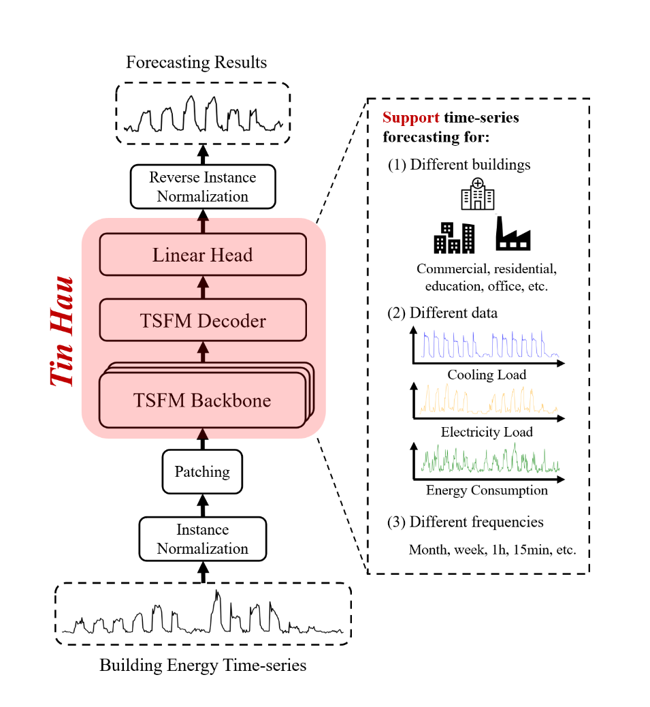

<h1 align="center">
    Tin Hau v0.8<br>A Building Time-series Foundation Model
</h1>

## Specification 

TinHau is a time-series foundation model for building load/energy forecasting which embeds the knowledge of thousands of 
buildings and adopts an advanced training strategy.
Thus, for different buildings with different contexts (e.g., dining areas, sports areas, etc), TinHau can perform accurate 
forecasting with limited or even no knowledge about the target building.
Developed based on Tiny Time Mixer from IBM, TinHau is a compact and lightweight model with only 1M parameters such that
it can be run even on **CPU-only machines**.

The current version TinHau v0.8 supports univariate zero-shot forecasting (i.e., no training on target building data, directly inference) 
and few-shot forecasting (i.e., train on 10% of target building data, then inference) with a fixed context length of 512 
(i.e., number of samples as input) and an adaptive horizon length of any positive integer (i.e., number of samples as 
forecast output). Besides, TinHau v0.8 only supports a hourly resolution/sampling frequency (_**Multi-resolution forecasting 
is currently supported in the latest version, TinHau v0.81. Apply for this release at [`Application Form for TinHau v0.81`](https://forms.gle/2BCMR76fZAdb3rAx5)**_).



## Initial Setup
Clone the repository using the following command.
```bash
git clone https://github.com/Dylan0211/TinHau-forecasting.git
```
The supported python version is 3.8. Use the following command to install required packages.
```bash
pip install -r requirements.txt
```

## Tutorial: How to do model inference on your own building data

### Step 1: prepare raw data file
- The target building energy data should be stored in a `{target_building}.csv` file with two columns:
    - **timestamp_column** is the column that contains the timestamp of the time-series (e.g., "time").
    - **target_columns** are the columns to be forecasted (e.g., "power").
    
- The `{target_building}.csv` file should be put under `dataset/{dataset_name}/`.
    - An example is the `Fox_office_Joy.csv` file under `dataset/Genome/`.

        |  | time | power |
        | :-----: | :----: | :----: |
        | 1 | 2016-12-29 12:00:00 | 205.47 |
        | 2 | 2016-12-29 13:00:00 | 206.74 |
        | 3 | 2016-12-29 14:00:00 | 206.77 |
        | 4 | 2016-12-29 15:00:00 | 205.77 |
        | 5 | 2016-12-29 16:00:00 | 201.93 |


### Step 2: config data loader
- The config of the target building should be specified for the data loader. Specifically, a config dict for the target 
building should be added to the `get_data()` function under `tsfm_public/models/tinytimemixer/utils/ttm_utils.py`. 
An example is shown as follows. Here, **"Genome"** is the name of the config dict (the same as the `{dataset_name}`) 
which contains variables to be specified:
    - **"timestamp_column"** is the name of the column that contains the timestamp of the time-series.
    - **"target_columns"** are the names of the columns that contains the variable to be forecasted.
    - **"split_config"** specifies the proportion of data used for training and testing. Here we set training ratio as 
  0.1 such that only 10% data will be used for few-shot forecasting.

  ```python
  # ttm_utils.py
  def get_data(
    dataset_name: str,
    file_name: str,
    data_root_path: str,
    context_length=512,
    forecast_length=96,
    fewshot_fraction=1.0,
  ):
    print(context_length, forecast_length)

    config_map = {
        "Genome": {  # for evaluating Genome
            "dataset_path": file_name,
            "timestamp_column": "time",
            "target_columns": ["power"],
            "split_config": {
                "train": 0.1,
                "test": 0.9,
            },
        },
    }
  ```

### Step 3: evaluate the model on the target building
- Evaluation can be conducted by running the `eval.py`. There are some parameters to be adjusted.
    - **dataset_name** is the name of your dataset, i.e.,`{dataset_name}`.
    - **file_name** is the name of the target building, i.e.,`{target_building}`.
    - **evaluation_mode** is the way for evaluation. This can be either 'zeroshot' or 'fewshot'.
    - **horizon_length** is the forecasting length. This value can be **any positive integer**.
  
  ```python
  # eval.py
  if __name__ == '__main__':
    # note: parameters that need to be adjusted
    dataset_name = "Genome"
    file_name = 'Fox_office_Joy'
    horizon_length = 96  # forecasting length (can be any positive integer)
    evaluation_mode = 'zeroshot'  # zeroshot, fewshot
  ```

## Latest version: TinHau v0.81
We present a new version of TinHau which supports multi-resolution forecasting at 1 hour, 15 mins, etc.
On our evaluation datasets including buildings with diverse temporal resolutions, TinHau v0.81 achieves **_40.1%_** performance 
enhancement as compared to TinHau v0.8 in terms of CV-RMSE.
**_Apply for the project of TinHau v0.81 by filling out this [`Application Form for TinHau v0.81`](https://forms.gle/2BCMR76fZAdb3rAx5) and we will send 
the download link to your email._**

## Feedback
Note that this is an early version of TinHau so we admit that there may be some building contexts where our
model perform poorly on.
In order to continuously improve TinHau, we are willing to hear your feedbacks or questions.
Therefore, if you encounter any problem when trying to run our model on your target building or you find that the performance of 
our model is not satisfying on your data, you can post issues on GitHub [`issue`](https://github.com/Dylan0211/TinHau-forecasting/issues) to describe the problem or share your experience.
We will check these issues occasionally and provide explanations or opinions.
  
